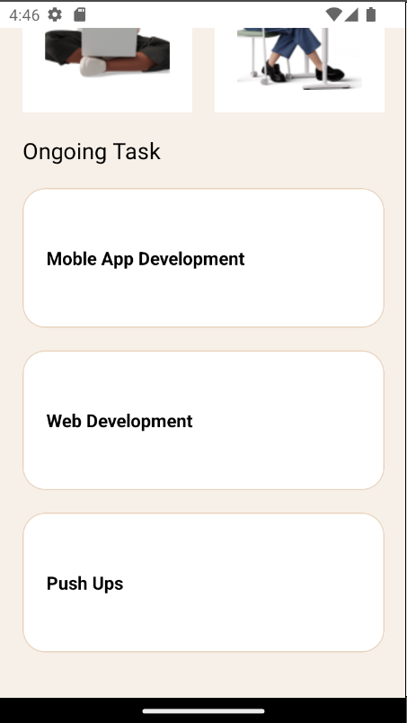

# rn-assignment3-11029640

# React Native Task Manager

## Description
This is a simple task manager app built with React Native. It has a navigation section, categories section, and ongoing tasks section. The app uses the following core components:

- View: This is used to wrap other components.
- Text: This is used to display text.
- ScrollView: This is used to enable scrolling.
- TextInput: This is used to get user input.
- Stylesheet: This is used to style components.
- Button: This is used to create buttons.
- FlatList: This is used to render lists of tasks.
- Image: This is used to display images.

## Screenshots

